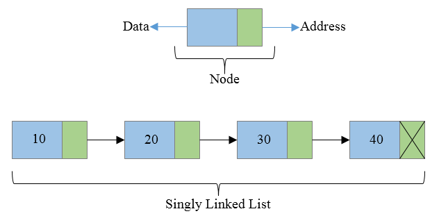

# Single linked list

In a singly linked list, each item points to the next one. The last item points to `null`.

#### Demonstration
```
[First Item] → [Second Item] → [Third Item] → null
```


#### `Example`

```python
class Node:
    def __init__(self, data):
        self.data = data
        self.next = None

class SinglyLinkedList:
    def __init__(self):
        self.head = None
        
    def prepend(self, data):
        """
        Add the item to the beginning of the list.
        """
        new_node = Node(data)
        new_node.next = self.head
        self.head = new_node

    def append(self, data):
        """
        Add the item to the end of the list.
        """
        new_node = Node(data)
        if self.head is None:
            self.head = new_node
            return
        last = self.head
        while last.next:
            last = last.next
        last.next = new_node

    def insert(self, index, data):
        """
        Insert the item at the given index.
        """
        if index == 0:
            self.prepend(data)
            return
        elif index == -1:
            self.append(data)
            return
        elif index < 0:
            raise IndexError('Negative index is not allowed')

        new_node = Node(data)
        current = self.head
        for _ in range(index - 1):
            if current is None:
                raise IndexError('Index out of range')
            current = current.next
        new_node.next = current.next
        current.next = new_node

    def remove(self, value):
        """
        Remove the first occurrence of the value from the list.
        """
        current = self.head
        if current and current.data == value:
            self.head = current.next
            return
        prev = None
        while current and current.data != value:
            prev = current
            current = current.next
        if current is None:
            return
        prev.next = current.next

    def remove_at(self, index):
        """
        Remove the item at the given index.
        """
        if index == 0:
            self.head = self.head.next
            return
        current = self.head
        prev = None
        for _ in range(index):
            if current is None:
                raise IndexError('Index out of range')
            prev = current
            current = current.next
        prev.next = current.next

    def print_list(self):
        """
        Print all the items in the list.
        """
        current = self.head
        while current:
            print(current.data, end=' ')
            current = current.next
        print() # new empty line
        
```