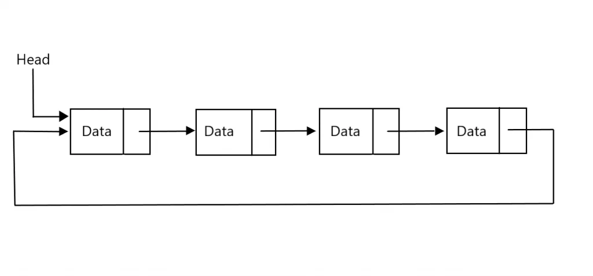

# Circular linked lists

A circular linked list is a type of linked list where the last item points to the first item. It's like a chain of items where the last item points to the first item.

#### Demonstration
```
[First Item] ↔ [Second Item] ↔ [Third Item] ↔ [First Item]
```



#### `Example`

```python
class Node:
    def __init__(self, data):
        self.data = data
        self.next = None

class CircularLinkedList:
    def __init__(self):
        self.head = None

    def append(self, data):
        new_node = Node(data)
        if not self.head:
            self.head = new_node
            self.head.next = self.head
        else:
            current = self.head
            while current.next != self.head:
                current = current.next
            current.next = new_node
            new_node.next = self.head

    def print_list(self):
        current = self.head
        while current:
            print(current.data)
            current = current.next
            if current == self.head:
                break

cll = CircularLinkedList()
cll.append(1)
cll.append(2)

cll.print_list()
```
